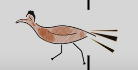
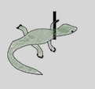
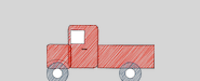

# RoadRunner
Welcome to RoadRunner, my first Java game! I developed this game (and artwork) over a two week period as a way to practice my Java skills. This game was developed to build on skills learned in my Introduction to Computer Science course.

## **GAME INSTRUCTIONS:**

**TO PLAY:** To play, download the game from your computer by clicking on the following link and select "keep". If you have a Mac may need to allow game to run by adjusting security preferences/settings. [Game Link Here](https://github.com/gmstern/roadrunner/raw/master/roadrunner.jar)

Note on System Requirements: You must have Java installed on your computer to play. If needed, click on the following link and select the appripriate system to download Java. [Download Java Here](https://www.oracle.com/java/technologies/javase/javase-jdk8-downloads.html)

**GAME OBJECTIVE:** In this game, the player is the roadrunner at the bottom of the window and the objective is to get a high score. The roadrunner can only move left and right within the road. I challenge you to beat my high score of 200! :)

**TO MOVE:** To move, press the left and right arrow keys on your computer. 

**GAINING POINTS:** To collect points, player must collect lizards. Each lizard is worth 10 points.

**LOSING LIVES:** The player begins with a total of three lives. You lose a life each time the player gets hit by either a cactus or a car. Be careful, they tend to speed up.

[Link to Full Demo Here](https://youtu.be/GjLHMNIQxLs)

**Thanks for playing and good luck!**
